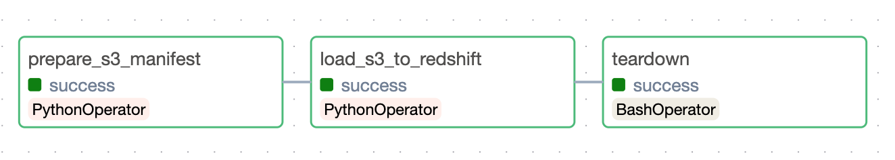
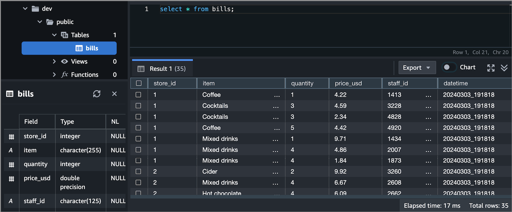

## Databloom
**[ Transfer data from S3 Bucket to Redshift ]**

Suppose that you have a data lakehouse and need to push data to data warehouse Redshift.
This example walks through how to set up an Airflow to transfer data from lakehouse S3 to warehouse Redshift.

### Prerequisites

> #### Make sure you have already completed these steps:
> - [x] Register Redshift Service
> - [x] Create IAM user and access key to access S3
> - [x] Create IAM role, associate IAM roles to Redshift


### Configuration

Sometimes, we have some kinds of data lakehouse to take advantage of these resources.
And we need to gather data to a warehouse from all lakehouses.

```db/drivers_config.py``` is a template for configurations to ensure stability of code.

Copy file ```stage.env``` to ```.env```

```.env``` provides the config for stage or production.

### Task flow

- If ```is_multi_files = False``` then task flow is:

  ```load_s3_to_redshift >> teardown```

- If ```is_multi_files = True```, it needs one more step to prepare manifest file before loads to Redshift.



**The table on Redshift would be like this**



